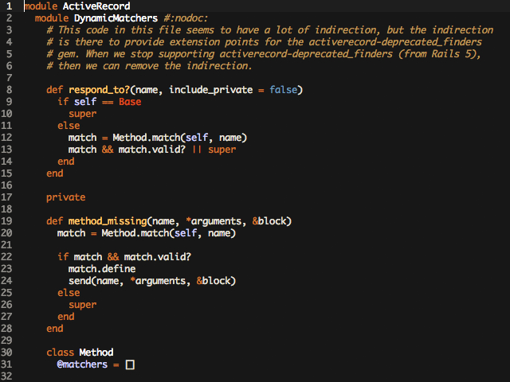

# Visual Studio Code - RailsCasts Theme
Dark UI theme for [Visual Studio Code](https://code.visualstudio.com) based on [Ryan Bates](http://railscasts.com/about) ([@rbates](https://twitter.com/rbates)) [RailsCasts TextMate theme](http://media.railscasts.com/resources/textmate_theme.zip).

## Installation

1. In Visual Studio Code, click `View => Command Palette....`
2. Choose `Extensions: Install Extension.`
3. Search for `RailsCasts` and click the download button at the bottom right.
4. Restart VS Code and the theme will be available.
5. Go to `File => Preferences => Color Theme` to find and begin using the theme.
